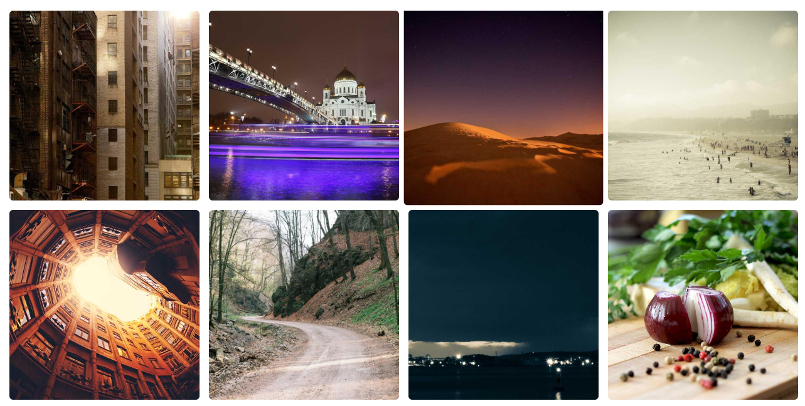
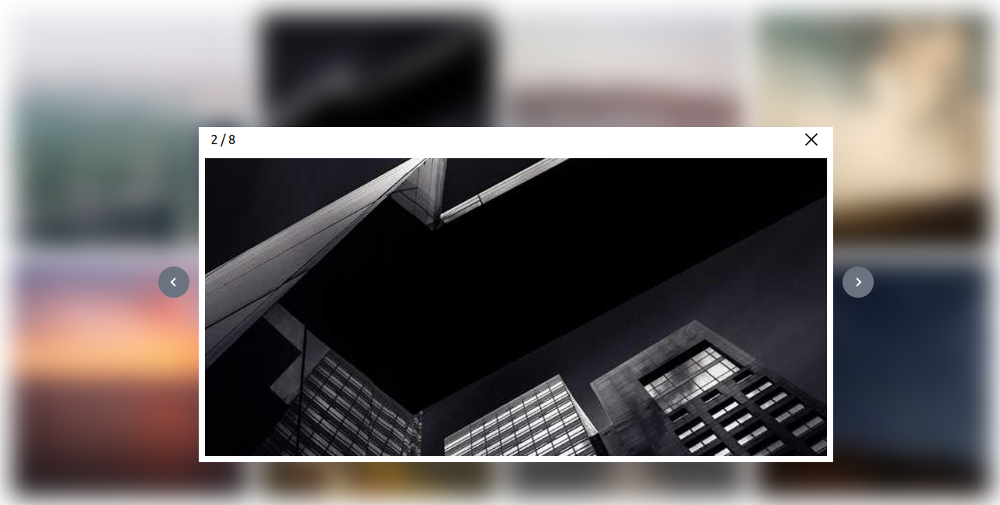

# cdx-gallery-lightbox

"cdx-gallery-lightbox" is a lightweight and customizable gallery lightbox package for displaying images and media content in an elegant and user-friendly way. It's designed for easy integration into web applications and provides a responsive and immersive viewing experience.





## Features

- Sleek and immersive lightbox for image and media content.
- Responsive design for various screen sizes.
- Next and previous navigation buttons for easy browsing.
- Supports high-resolution images and multimedia content.
- Customization options to fit your project's style.

## Installation

You can install "cdx-gallery-lightbox" using npm or yarn:

```bash
npm install cdx-gallery-lightbox
# or
yarn add cdx-gallery-lightbox
```

## Code:

```bash

import React from 'react'
import {Gallery} from 'cdx-gallery-lightbox'
import Image1 from "../assets/image1.png"
import Image2 from "../assets/image2.png"
import Image3 from "../assets/image3.png"
import Image4 from "../assets/image4.png"


const Home = () => {

const ImageArray =[
    Image1,
    Image2,
    Image3,
    Image4
]

  return (
    <Gallery imagesArray={ImageArray}  />
  )
}

export default Home

```

## Props Reference:

| Props                   | Description                     | Units                                                        | Default                      |
| ----------------------- | ------------------------------- | ------------------------------------------------------------ | ---------------------------- |
| galleryWidth?: string   | width of the gallery            | percentage (%)                                               | "100%"                       |
| galleryBgColor?: string | background color of the gallery | Default Tailwind Colors (eg: "bg-red-500" ) , not like "red" | "bg-white"                   |
| imageWidth?: string     | width of the image              | pixels (px)                                                  | "250px"                      |
| gap?: string            | gap between the images          | number                                                       | 15                           |
| imagesArray?: string[]  | Arrays of the images            | [Image1, Image2, Image3 ]                                    | Array containing five images |
